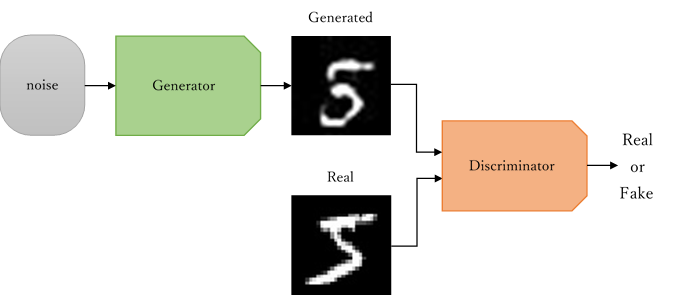
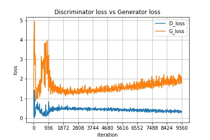

# DCGAN

## 実行環境
Python 3.6
### 追加パッケージ
* tensorflow==1.15.0
* keras==2.2.5
* numpy==1.16.5
* matplotlib==3.0.3
* Pillow==4.3.0

## 説明
DCGANにより手書き数字(0~9)の画像を生成します。
### DCGANの仕組み
DCGANとはGAN(敵対的生成ネットワーク)に対して、CNN(畳み込みニューラルネットワーク)を適用した手法です。  
GANではGenerator(画像生成器)とDiscriminator(画像判別器)という2つの学習モデルを使用します。  
Generatorはノイズを入力することでより本物に近い画像を生成します。
Discriminatorは生成画像か本物の画像を入力しその画像がどちらか判別します。  
これを繰り返し行うことによりGeneratorは訓練データと同じような画像を生成できるモデルとなります。  
GANの構造を下図に示しています。  
  
DCGANはGANの構造と同様ですが、2つのモデルにCNNを適用することで学習を安定させることができます。

## 使い方
[GoogleColaboratory](https://colab.research.google.com/)の無料GPU環境を使い実装しています。  
[ここ](https://colab.research.google.com/github/W-Fujita/DCGAN/blob/master/DCGAN.ipynb)から実行することができます。

## 実行結果
  
64個分の数字の画像を20回分学習した結果をgif形式で表示しています。  
  
DiscriminatorとGeneratorの損失値を示しています。
468(iteration/epoch)としています。
それぞれの損失値が一定の数値に収束するような均衡したモデルが良いとされています。  
途中からGeneratorの損失値は上昇傾向にあり、Discriminatorに競り負けてきていることが分かります。